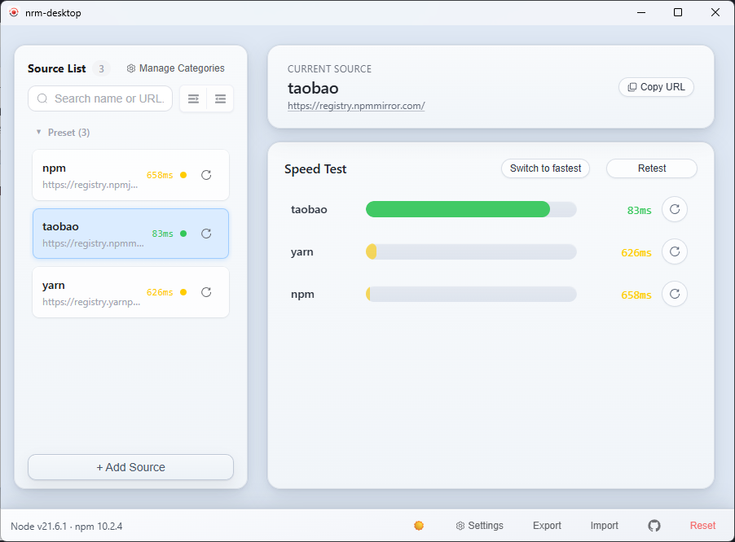
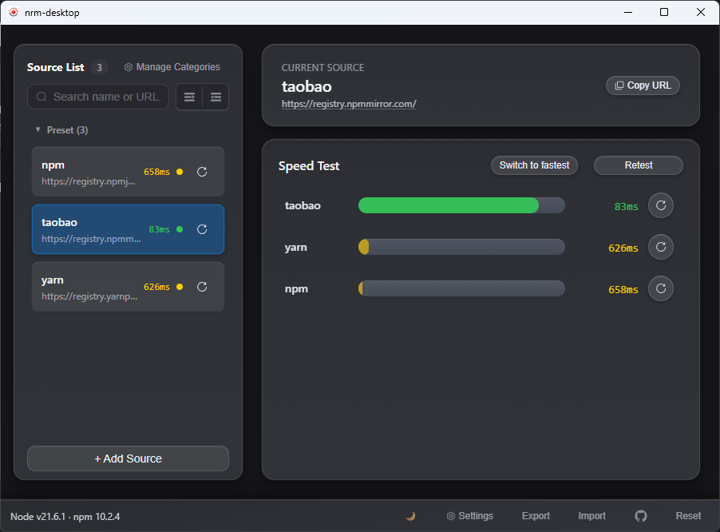

# nrm-desktop

[简体中文](./README.zh-CN.md) · [Changelog](./CHANGELOG.md)

[](./LICENSE)
[](https://v2.tauri.app/)
[](https://vuejs.org/)
[](https://www.rust-lang.org/)

A lightweight desktop GUI for npm registry management. Built with **Tauri 2 + Vue 3 + Rust**.

Switch, manage, and test npm registries — without touching the terminal.

## Screenshots

**English UI** shown below. For Simplified Chinese, see [README.zh-CN.md](./README.zh-CN.md#screenshots).

| Light | Dark |
|-------|------|
|  |  |

## Why nrm-desktop

| | nrm-desktop | nrm (CLI) |
|---|---|---|
| Interface | Desktop GUI | Terminal only |
| Speed test | Per-source & bulk, visual results | `nrm test` only |
| Categories | Drag-and-drop category management | Not supported |
| Import/Export | One-click config backup | Manual `.npmrc` editing |
| Tray access | System tray quick switch | Not available |
| Runtime | Tauri (Rust + WebView), ~10 MB footprint | Node.js CLI |

## Features

**Registry Management**
- Add, edit, delete, and switch npm registries in one click
- Preset registries out of the box (npm, yarn, taobao, etc.)
- Custom category groups with drag-and-drop reordering

**Speed Testing**
- Test latency for a single source or all sources at once
- Visual speed indicators for quick comparison

**Workflow Tools**
- Import/export registry configuration
- Registry detail dialog with quick copy (URL, latency, category, etc.)
- System tray for fast switching without opening the main window

**Personalization**
- Light / dark / auto theme
- Simplified Chinese / English UI

## Quick Start

### Prerequisites

- [Node.js](https://nodejs.org/) 20.19+
- [pnpm](https://pnpm.io/)
- [Rust toolchain](https://www.rust-lang.org/tools/install) (`rustup`, `cargo`)
- OS-specific Tauri dependencies — see [Tauri v2 Prerequisites](https://v2.tauri.app/start/prerequisites/)

<details>
<summary><strong>Windows packaging requirements</strong> (for developers building installers)</summary>

**Runtime** (end users):
- Microsoft Edge WebView2 Runtime — preinstalled on modern Windows, or install via:
  ```bash
  choco install microsoft-edge-webview2-runtime -y
  ```
  [Download page](https://developer.microsoft.com/microsoft-edge/webview2/)

**Build tools** (developers):
- Microsoft Visual Studio C++ Build Tools (MSVC) + Windows 10/11 SDK
- NSIS — `choco install nsis -y` — [Download](https://nsis.sourceforge.io/Download)
- WiX Toolset — `choco install wixtoolset -y` — [Download](https://wixtoolset.org/)

</details>

### Install & Run

```bash
# Install dependencies
pnpm install

# Start in development mode
pnpm dev

# Build production installers
pnpm build
```

## Scripts

| Command | Description |
|---------|-------------|
| `pnpm dev` | Start desktop app in dev mode (auto port selection) |
| `pnpm build` | Build desktop binaries/installers |
| `pnpm build:win` | Build Windows installer only |
| `pnpm ui:dev` | Start Vite frontend dev server only |
| `pnpm ui:build` | Type-check and build frontend only |
| `pnpm lint` | ESLint check |
| `pnpm test` | Vitest unit tests |
| `pnpm tauri` | Pass-through Tauri CLI |
| `pnpm update:logo` | Generate icon set from `src-tauri/icons/logo.png` |
| `pnpm version` | Sync app version metadata |

## Release (GitHub Actions)

Cross-platform installers are built in CI — no need to switch between Windows and macOS machines.

### One-click release

1. Develop on `dev`, then merge into `main` (PR or direct merge).
2. Open **Actions → Release Installers → Run workflow** on **`main`**.
3. Enter **version** (e.g. `1.0.1`), optionally enable **draft_release**, **overwrite_release**, and choose platforms/installer formats, then run.
4. CI will bump versions, archive changelogs, commit to `main`, build installers, create a GitHub Release, and **merge the release commit back into `dev`**.
5. Locally: `git checkout dev && git pull origin dev` to continue development.

**Retry / overwrite the same version:**

| Scenario | What to do |
|----------|------------|
| First publish failed and no GitHub Release exists for that version | Re-run the workflow with the **same version**; CI uses **retry** mode and skips bumping version or archiving changelogs |
| Release already exists and you need to re-upload installers | Enable **overwrite_release**; **version** must match the current `package.json` version; CI overwrites release assets and retargets the tag to the latest build commit |
| Release exists but overwrite is not enabled | The workflow fails at the pre-check step with a clear message |

Retry and overwrite runs **do not** sync a release commit to `dev` (no new bump commit is created).

Default release artifacts: Windows `setup.exe`, `.msi`, `portable.zip`, and macOS Apple Silicon `.dmg`; uncheck any formats you do not want to publish.

Before releasing, you can edit the install guide templates under [`docs/release-install-guide.md`](./docs/release-install-guide.md) and [`docs/release-install-guide.zh-CN.md`](./docs/release-install-guide.zh-CN.md). The release notes will include English download instructions by default, with a collapsible Chinese section; filenames and download links are generated automatically from the build config.

### Build only (no Release)

Open **Actions → Build Installers → Run workflow** and choose platforms and Windows artifacts. Uploads Artifacts only (14-day retention) for testing packaging options.

### Repository settings

- **Settings → Actions → General → Workflow permissions**: enable **Read and write permissions**.
- If branch protection is enabled on **`main`** or **`dev`**, allow `github-actions[bot]` to push (or configure a PAT secret for release commits).

## Tech Stack

| Layer | Technology |
|-------|-----------|
| Frontend | Vue 3, TypeScript, Pinia, Element Plus, UnoCSS, Vite |
| Desktop | Tauri 2 |
| Backend | Rust (reqwest, tokio) |

## Project Structure

```
src/                    # Vue frontend
  components/           #   UI modules (registry list, cards, dialogs)
  composables/          #   Reusable hooks (i18n, animation, behavior)
  stores/               #   Pinia state management
  api/                  #   Tauri command wrappers
src-tauri/
  src/                  # Rust backend (npmrc ops, speed test, tray, proxy)
  icons/                # App icon assets
scripts/                # Dev/build helpers (auto-port, icon gen, version sync)
docs/images/            # README screenshots
```

## Configuration & Data

| Path | Content |
|------|---------|
| `~/.nrm-desktop/` | Custom registries and metadata |
| `~/.npmrc` | npm config managed by the app |
| `~/.nrm-desktop/.instance.lock` | Single-instance lock |

## Contributing

1. Fork and create a feature branch
2. Make focused changes with clear commit messages
3. Run `pnpm dev` and verify locally
4. Open a PR with a concise description

## License

[Apache-2.0](./LICENSE)
