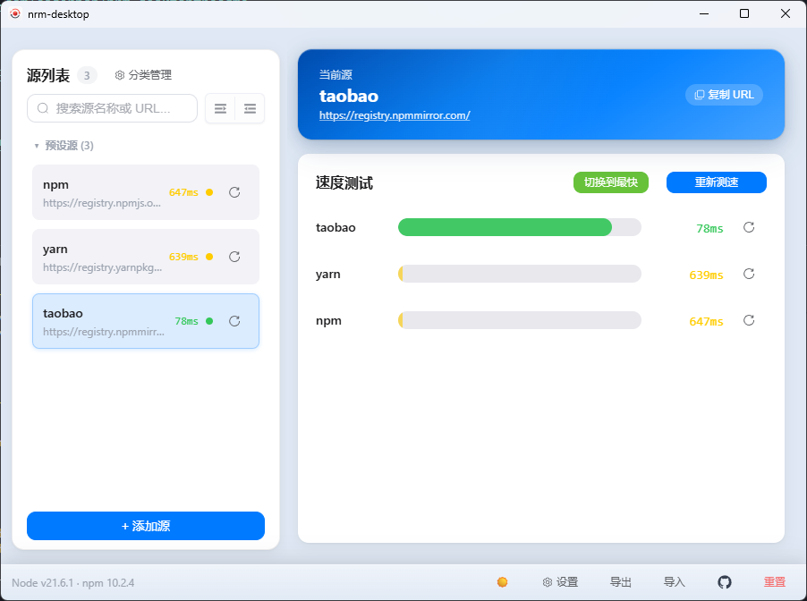
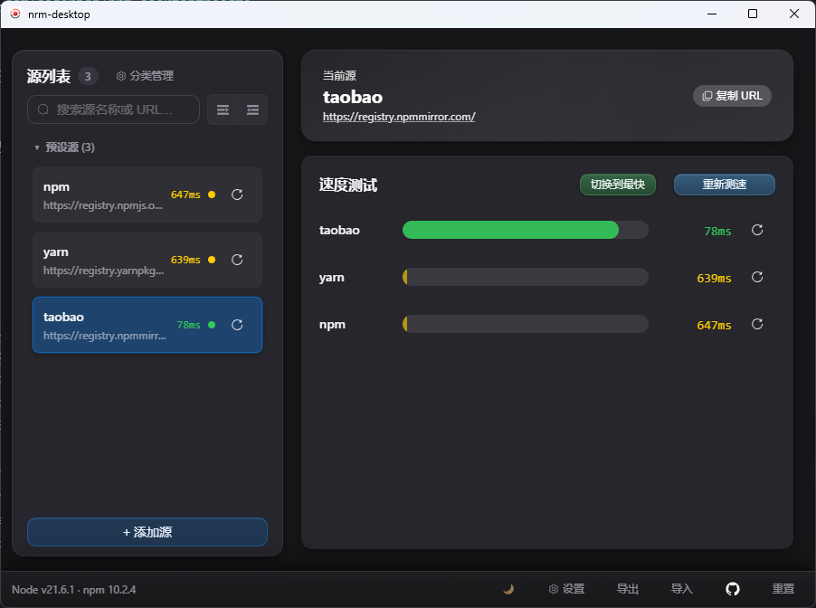

# nrm-desktop

[English](./README.md)

[](./LICENSE)
[](https://v2.tauri.app/)
[](https://vuejs.org/)
[](https://www.rust-lang.org/)

轻量级 npm 源管理桌面客户端，基于 **Tauri 2 + Vue 3 + Rust** 构建。

一键切换、管理、测速 npm 源 —— 告别命令行。

## 界面预览

以下为 **简体中文** 界面。英文界面见 [README.md](./README.md#screenshots)。

| 浅色主题 | 深色主题 |
|---------|---------|
|  |  |

## 为什么选择 nrm-desktop

| | nrm-desktop | nrm (CLI) |
|---|---|---|
| 界面 | 桌面 GUI | 纯终端 |
| 测速 | 单源/批量测速，可视化结果 | 仅 `nrm test` |
| 分类管理 | 拖拽式分类管理 | 不支持 |
| 导入导出 | 一键备份配置 | 手动编辑 `.npmrc` |
| 托盘快捷 | 系统托盘快速切换 | 无 |
| 运行时 | Tauri (Rust + WebView)，约 10 MB 体积 | Node.js CLI |

## 功能特性

**源管理**
- 一键新增、编辑、删除、切换 npm 源
- 内置常用预设源（npm、yarn、taobao 等）
- 自定义分类分组，支持拖拽排序

**测速**
- 单源测速 / 全量批量测速
- 可视化速度指标，快速对比

**效率工具**
- 导入/导出源配置
- 源详情弹窗，快速复制 URL、认证信息等
- 系统托盘快捷切换，无需打开主窗口

**个性化**
- 浅色 / 深色 / 跟随系统主题
- 简体中文 / 英文界面

## 快速开始

### 环境要求

- [Node.js](https://nodejs.org/) 18+
- [pnpm](https://pnpm.io/)
- [Rust 工具链](https://www.rust-lang.org/tools/install)（`rustup`、`cargo`）
- 系统对应的 Tauri 依赖 —— 参见 [Tauri v2 Prerequisites](https://v2.tauri.app/start/prerequisites/)

<details>
<summary><strong>Windows 打包环境</strong>（开发者构建安装包时需要）</summary>

**运行环境**（最终用户）：
- Microsoft Edge WebView2 Runtime —— 新版 Windows 通常已预装，缺失时可手动安装：
  ```bash
  choco install microsoft-edge-webview2-runtime -y
  ```
  [下载页面](https://developer.microsoft.com/microsoft-edge/webview2/)

**构建工具**（开发者）：
- Microsoft Visual Studio C++ Build Tools (MSVC) + Windows 10/11 SDK
- NSIS — `choco install nsis -y` — [下载](https://nsis.sourceforge.io/Download)
- WiX Toolset — `choco install wixtoolset -y` — [下载](https://wixtoolset.org/)

</details>

### 安装与运行

```bash
# 安装依赖
pnpm install

# 启动开发模式
pnpm dev

# 构建发布包
pnpm build
```

## 可用脚本

| 命令 | 说明 |
|------|------|
| `pnpm dev` | 启动桌面开发模式（自动选择端口） |
| `pnpm build` | 构建桌面安装包/可执行文件 |
| `pnpm build:win` | 仅构建 Windows 安装包 |
| `pnpm ui:dev` | 仅启动 Vite 前端开发服务 |
| `pnpm ui:build` | 前端类型检查与构建 |
| `pnpm tauri` | 透传 Tauri CLI 命令 |
| `pnpm update:logo` | 基于 `src-tauri/icons/logo.png` 生成图标集 |
| `pnpm version` | 同步应用版本元数据 |

## 技术栈

| 层级 | 技术 |
|------|------|
| 前端 | Vue 3、TypeScript、Pinia、Element Plus、UnoCSS、Vite |
| 桌面运行时 | Tauri 2 |
| 后端 | Rust（reqwest、tokio） |

## 项目结构

```
src/                    # Vue 前端
  components/           #   界面模块（源列表、卡片、弹窗等）
  composables/          #   可复用 Hooks（国际化、动效、行为逻辑）
  stores/               #   Pinia 状态管理
  api/                  #   Tauri 命令封装
src-tauri/
  src/                  # Rust 后端（npmrc 操作、测速、托盘、代理）
  icons/                # 应用图标资源
scripts/                # 开发/构建辅助脚本（自动端口、图标生成、版本同步）
docs/images/            # README 截图
```

## 配置与数据位置

| 路径 | 内容 |
|------|------|
| `~/.nrm-desktop/` | 自定义源与元数据 |
| `~/.npmrc` | 应用管理的 npm 配置文件 |
| `~/.nrm-desktop/.instance.lock` | 单实例锁文件 |

## 参与贡献

1. Fork 仓库并创建功能分支
2. 保持改动聚焦，提交信息清晰
3. 运行 `pnpm dev` 本地验证
4. 提交 PR 并附上简要说明

## 许可证

[Apache-2.0](./LICENSE)
